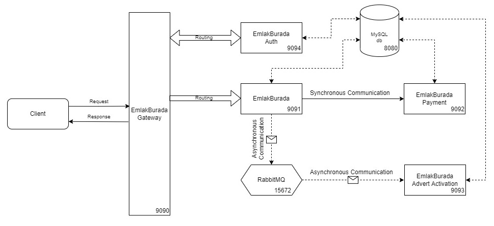

#  170. Patika.dev & Hepsiemlak Java - Spring Boot Bootcamp


## Final Project

###### Tacettin Utku Süer


### Getting started

The project requirements sheet is in the link below.

```
https://github.com/TacettinUtkuSuer/Bootcamp-Final-Project/blob/main/BootcampFinalProject.pdf
```

Within the scope of this project, 5 services have been prepared.

- EmlakBurada
- EmlakBurada - Gateway
- EmlakBurada - Payment
- EmlakBurada - AdvertActivation
- EmlakBurada - Auth

For a quick start, if you want to try the project, the following files can be used.

```
POSTMAN  : https://github.com/TacettinUtkuSuer/Bootcamp-Final-Project/blob/main/otherFiles/BOOTCAMP-PROJECT.postman_collection.json

MySQL    : https://github.com/TacettinUtkuSuer/Bootcamp-Final-Project/blob/main/otherFiles/EmlakBuradaProject.sql

RabbitMQ : https://github.com/TacettinUtkuSuer/Bootcamp-Final-Project/blob/main/otherFiles/rabbitMQ.json
```

Dummy SQL database can also be created with the "/prepare" end point in the EmlakBurada service (port 9091).


### The Service Schema and Service Definitions



The services schema is shown above. Client requests and response are provided through the gateway layer (port 9090). All requests are provided from this layer. Gateway also provides security operations. In order to access the EmlakBurada service, you must first login to the system or use a previously created token that has not expired. Even if the port numbers are given in the schema, the client only needs to know the gateway port.


The e-mail and password request from the Gateway layer are compared with the information in the database. After evaluating, if allowed, a JWT token is created and this token is sent in response. This created token provides access to EmlakBurada service, in other words, to these end points.


End points can be accessed via Gateway with the token information. The end points on EmlakBurada are shown in the figure below. Information can be transferred from this service to the EmlakBurada-Payment service via synchronous communication. The communication with the EmlakBurada - AdvertActivation service is done with asynchronous communication using RabbitMQ.


The payment service simulates the communication with the bank. Since bank communication is not within the scope of this project, this service shows the payment request received by typing it into the database. For future situations such as a change in the price of the product, the price information is located on the database and is read from the database with a key-value relationship. Thus, a dependency is not created.


The status of newly created advert is IN_REVIEW. In order to switch from this status to ACTIVE status, EmlakBurada-AdvertActivation service is used with asynchronous communication.


### Considerations During the Writing of the Project

- During the project writing, git has been used and an explanatory commit was made at the necessary points.
- It has been tried to make sure that the code is clean, understandable and easy to read.
- It has been tried to be written in accordance with the code structure. It was created taking into account the layered architecture (controller-service-repository). 
- This project has been tried to be done in accordance with the microservice architecture.
- Logging and Exception Handling have been tried to be used.
- Programming principles (SOLID) were tried to be taken into account.


### Future Work

- Logging and Exception Handling can be diversified to make them more inclusive across the whole code.
- Logging operations can be made polymorphic and written to a file or database.
- Access to other services (except Gateway) can be restricted for more security.
- Service layer can be improved to avoid code duplication.
- Instead of using a common database, each service can be connecting to its own database to be more secure (especially for credit card information).
- Methods for filtering advertisements by automatically catching inappropriate things such as profanity can be added to EmlakHere - AdvertActivation service.
- User interactions can also be included by combining it with the EmlakBurada project, which was previously written within the scope of the Bootcamp.


